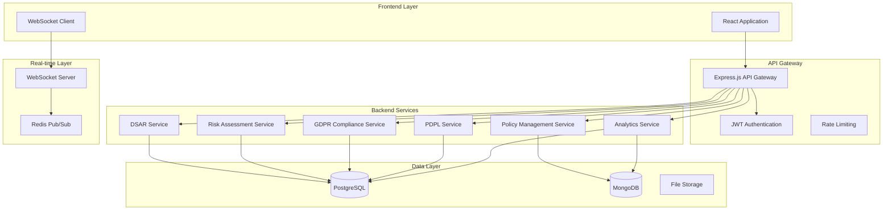

# Backend Database Integration Design

## Overview

This design document outlines the architecture for transforming the PrivacyGuard application from a mock-data frontend into a full-stack application with persistent data storage, real-time updates, and comprehensive API services. The solution implements a microservices architecture with separate services for different privacy compliance domains while maintaining data consistency and real-time synchronization.

## Architecture

### High-Level Architecture



### Database Schema Design

#### PostgreSQL Schema (Structured Data)

**Users & Authentication**
```sql
-- Users table for authentication and authorization
CREATE TABLE users (
    id UUID PRIMARY KEY DEFAULT gen_random_uuid(),
    email VARCHAR(255) UNIQUE NOT NULL,
    password_hash VARCHAR(255) NOT NULL,
    name VARCHAR(255) NOT NULL,
    role VARCHAR(50) NOT NULL CHECK (role IN ('admin', 'dpo', 'compliance', 'legal', 'business')),
    department VARCHAR(255),
    permissions JSONB DEFAULT '[]',
    last_login TIMESTAMP,
    created_at TIMESTAMP DEFAULT NOW(),
    updated_at TIMESTAMP DEFAULT NOW()
);

-- Sessions for JWT token management
CREATE TABLE user_sessions (
    id UUID PRIMARY KEY DEFAULT gen_random_uuid(),
    user_id UUID REFERENCES users(id) ON DELETE CASCADE,
    token_hash VARCHAR(255) NOT NULL,
    expires_at TIMESTAMP NOT NULL,
    created_at TIMESTAMP DEFAULT NOW()
);
```

**DSAR Management**
```sql
-- DSAR requests with full lifecycle tracking
CREATE TABLE dsar_requests (
    id UUID PRIMARY KEY DEFAULT gen_random_uuid(),
    request_id VARCHAR(50) UNIQUE NOT NULL,
    subject_name VARCHAR(255) NOT NULL,
    subject_email VARCHAR(255) NOT NULL,
    request_type VARCHAR(50) NOT NULL,
    status VARCHAR(50) NOT NULL DEFAULT 'submitted',
    priority VARCHAR(20) DEFAULT 'medium',
    description TEXT,
    legal_basis TEXT,
    data_categories JSONB DEFAULT '[]',
    processing_purposes JSONB DEFAULT '[]',
    assigned_to UUID REFERENCES users(id),
    due_date TIMESTAMP,
    completed_at TIMESTAMP,
    created_at TIMESTAMP DEFAULT NOW(),
    updated_at TIMESTAMP DEFAULT NOW()
);

-- DSAR status history for audit trail
CREATE TABLE dsar_status_history (
    id UUID PRIMARY KEY DEFAULT gen_random_uuid(),
    dsar_id UUID REFERENCES dsar_requests(id) ON DELETE CASCADE,
    status VARCHAR(50) NOT NULL,
    comment TEXT,
    changed_by UUID REFERENCES users(id),
    changed_at TIMESTAMP DEFAULT NOW()
);
```

**Risk Assessment**
```sql
-- Risk assessments and vulnerability tracking
CREATE TABLE risk_assessments (
    id UUID PRIMARY KEY DEFAULT gen_random_uuid(),
    name VARCHAR(255) NOT NULL,
    description TEXT,
    risk_level VARCHAR(20) NOT NULL,
    impact_score INTEGER CHECK (impact_score BETWEEN 1 AND 5),
    likelihood_score INTEGER CHECK (likelihood_score BETWEEN 1 AND 5),
    overall_score DECIMAL(3,2),
    status VARCHAR(50) DEFAULT 'active',
    category VARCHAR(100),
    data_types JSONB DEFAULT '[]',
    mitigation_measures JSONB DEFAULT '[]',
    owner_id UUID REFERENCES users(id),
    review_date DATE,
    created_at TIMESTAMP DEFAULT NOW(),
    updated_at TIMESTAMP DEFAULT NOW()
);

-- Compliance gaps and findings
CREATE TABLE compliance_findings (
    id UUID PRIMARY KEY DEFAULT gen_random_uuid(),
    title VARCHAR(255) NOT NULL,
    description TEXT,
    regulation VARCHAR(50) NOT NULL,
    severity VARCHAR(20) NOT NULL,
    status VARCHAR(50) DEFAULT 'open',
    category VARCHAR(100),
    affected_systems JSONB DEFAULT '[]',
    remediation_steps JSONB DEFAULT '[]',
    assigned_to UUID REFERENCES users(id),
    due_date DATE,
    resolved_at TIMESTAMP,
    created_at TIMESTAMP DEFAULT NOW(),
    updated_at TIMESTAMP DEFAULT NOW()
);
```

**GDPR Compliance**
```sql
-- Lawful basis tracking
CREATE TABLE lawful_basis_records (
    id UUID PRIMARY KEY DEFAULT gen_random_uuid(),
    processing_activity VARCHAR(255) NOT NULL,
    lawful_basis VARCHAR(100) NOT NULL,
    data_categories JSONB DEFAULT '[]',
    purposes JSONB DEFAULT '[]',
    data_subjects JSONB DEFAULT '[]',
    retention_period VARCHAR(100),
    status VARCHAR(50) DEFAULT 'active',
    review_date DATE,
    created_at TIMESTAMP DEFAULT NOW(),
    updated_at TIMESTAMP DEFAULT NOW()
);

-- Records of processing activities
CREATE TABLE processing_records (
    id UUID PRIMARY KEY DEFAULT gen_random_uuid(),
    activity_name VARCHAR(255) NOT NULL,
    controller VARCHAR(255) NOT NULL,
    processor VARCHAR(255),
    purposes JSONB DEFAULT '[]',
    lawful_basis VARCHAR(100) NOT NULL,
    data_categories JSONB DEFAULT '[]',
    data_subjects JSONB DEFAULT '[]',
    recipients JSONB DEFAULT '[]',
    third_country_transfers BOOLEAN DEFAULT FALSE,
    retention_period VARCHAR(100),
    technical_measures JSONB DEFAULT '[]',
    organisational_measures JSONB DEFAULT '[]',
    created_at TIMESTAMP DEFAULT NOW(),
    updated_at TIMESTAMP DEFAULT NOW()
);
```

#### MongoDB Schema (Document Data)

**Policy Documents**
```javascript
// Policy documents with version control
{
  _id: ObjectId,
  title: String,
  type: String, // 'privacy_policy', 'cookie_policy', 'terms_of_service'
  content: String,
  version: String,
  status: String, // 'draft', 'active', 'archived'
  language: String,
  jurisdiction: String,
  effective_date: Date,
  expiry_date: Date,
  created_by: String, // User ID
  approved_by: String, // User ID
  approval_date: Date,
  tags: [String],
  metadata: {
    word_count: Number,
    last_review_date: Date,
    next_review_date: Date,
    compliance_frameworks: [String]
  },
  version_history: [{
    version: String,
    changes: String,
    changed_by: String,
    changed_at: Date
  }],
  created_at: Date,
  updated_at: Date
}
```

**Analytics and Reporting Data**
```javascript
// Aggregated analytics data
{
  _id: ObjectId,
  metric_type: String, // 'dsar_volume', 'risk_trends', 'compliance_score'
  period: String, // 'daily', 'weekly', 'monthly'
  date_range: {
    start: Date,
    end: Date
  },
  data: {
    // Flexible structure for different metric types
    total_count: Number,
    breakdown: Object,
    trends: [Object],
    comparisons: Object
  },
  filters: Object,
  generated_by: String,
  generated_at: Date
}
```

## Components and Interfaces

### API Service Layer

#### Authentication Service
```typescript
interface AuthService {
  login(email: string, password: string): Promise<AuthResponse>;
  logout(token: string): Promise<void>;
  validateToken(token: string): Promise<User>;
  refreshToken(refreshToken: string): Promise<AuthResponse>;
  getUserPermissions(userId: string): Promise<Permission[]>;
}

interface AuthResponse {
  user: User;
  accessToken: string;
  refreshToken: string;
  expiresIn: number;
}
```

#### DSAR Service
```typescript
interface DSARService {
  createRequest(request: CreateDSARRequest): Promise<DSARRequest>;
  getRequests(filters: DSARFilters): Promise<PaginatedResponse<DSARRequest>>;
  updateRequestStatus(id: string, status: DSARStatus, comment?: string): Promise<DSARRequest>;
  assignRequest(id: string, assigneeId: string): Promise<DSARRequest>;
  generateReport(id: string): Promise<DSARReport>;
  getStatusHistory(id: string): Promise<DSARStatusHistory[]>;
}
```

#### Risk Assessment Service
```typescript
interface RiskService {
  createAssessment(assessment: CreateRiskAssessment): Promise<RiskAssessment>;
  getAssessments(filters: RiskFilters): Promise<PaginatedResponse<RiskAssessment>>;
  updateAssessment(id: string, updates: Partial<RiskAssessment>): Promise<RiskAssessment>;
  calculateRiskScore(assessment: RiskAssessment): Promise<RiskScore>;
  getComplianceFindings(filters: ComplianceFilters): Promise<ComplianceFinding[]>;
  generateRiskReport(filters: ReportFilters): Promise<RiskReport>;
}
```

### Real-time Communication

#### WebSocket Event System
```typescript
interface WebSocketEvents {
  // DSAR events
  'dsar:created': DSARRequest;
  'dsar:updated': DSARRequest;
  'dsar:status_changed': DSARStatusChange;
  
  // Risk events
  'risk:assessment_updated': RiskAssessment;
  'risk:new_finding': ComplianceFinding;
  'risk:alert': RiskAlert;
  
  // System events
  'system:notification': SystemNotification;
  'system:user_activity': UserActivity;
}

interface WebSocketService {
  subscribe(event: keyof WebSocketEvents, callback: Function): void;
  unsubscribe(event: keyof WebSocketEvents, callback: Function): void;
  emit(event: keyof WebSocketEvents, data: any): void;
  joinRoom(room: string): void;
  leaveRoom(room: string): void;
}
```

### Data Access Layer

#### Repository Pattern Implementation
```typescript
interface BaseRepository<T> {
  create(entity: Omit<T, 'id' | 'created_at' | 'updated_at'>): Promise<T>;
  findById(id: string): Promise<T | null>;
  findMany(filters: FilterOptions): Promise<PaginatedResponse<T>>;
  update(id: string, updates: Partial<T>): Promise<T>;
  delete(id: string): Promise<void>;
  count(filters?: FilterOptions): Promise<number>;
}

interface DSARRepository extends BaseRepository<DSARRequest> {
  findByRequestId(requestId: string): Promise<DSARRequest | null>;
  findBySubjectEmail(email: string): Promise<DSARRequest[]>;
  getStatusHistory(dsarId: string): Promise<DSARStatusHistory[]>;
  updateStatus(id: string, status: DSARStatus, userId: string, comment?: string): Promise<void>;
}
```

## Data Models

### Core Entity Models

#### User and Authentication
```typescript
interface User {
  id: string;
  email: string;
  name: string;
  role: 'admin' | 'dpo' | 'compliance' | 'legal' | 'business';
  department?: string;
  permissions: Permission[];
  lastLogin?: Date;
  createdAt: Date;
  updatedAt: Date;
}

interface Permission {
  resource: string;
  actions: ('create' | 'read' | 'update' | 'delete')[];
  conditions?: Record<string, any>;
}
```

#### DSAR Models
```typescript
interface DSARRequest {
  id: string;
  requestId: string;
  subjectName: string;
  subjectEmail: string;
  requestType: 'access' | 'rectification' | 'erasure' | 'portability' | 'restriction' | 'objection';
  status: 'submitted' | 'in_review' | 'in_progress' | 'completed' | 'rejected' | 'cancelled';
  priority: 'low' | 'medium' | 'high' | 'urgent';
  description?: string;
  legalBasis?: string;
  dataCategories: string[];
  processingPurposes: string[];
  assignedTo?: string;
  dueDate?: Date;
  completedAt?: Date;
  createdAt: Date;
  updatedAt: Date;
}

interface DSARStatusHistory {
  id: string;
  dsarId: string;
  status: DSARStatus;
  comment?: string;
  changedBy: string;
  changedAt: Date;
}
```

#### Risk Assessment Models
```typescript
interface RiskAssessment {
  id: string;
  name: string;
  description?: string;
  riskLevel: 'low' | 'medium' | 'high' | 'critical';
  impactScore: number; // 1-5
  likelihoodScore: number; // 1-5
  overallScore: number;
  status: 'active' | 'mitigated' | 'accepted' | 'transferred';
  category?: string;
  dataTypes: string[];
  mitigationMeasures: MitigationMeasure[];
  ownerId?: string;
  reviewDate?: Date;
  createdAt: Date;
  updatedAt: Date;
}

interface ComplianceFinding {
  id: string;
  title: string;
  description?: string;
  regulation: 'GDPR' | 'CCPA' | 'HIPAA' | 'PDPL' | 'Other';
  severity: 'low' | 'medium' | 'high' | 'critical';
  status: 'open' | 'in_progress' | 'resolved' | 'accepted';
  category?: string;
  affectedSystems: string[];
  remediationSteps: RemediationStep[];
  assignedTo?: string;
  dueDate?: Date;
  resolvedAt?: Date;
  createdAt: Date;
  updatedAt: Date;
}
```

## Error Handling

### Error Response Structure
```typescript
interface APIError {
  code: string;
  message: string;
  details?: Record<string, any>;
  timestamp: Date;
  requestId: string;
  path: string;
}

interface ValidationError extends APIError {
  code: 'VALIDATION_ERROR';
  details: {
    field: string;
    message: string;
    value?: any;
  }[];
}

interface DatabaseError extends APIError {
  code: 'DATABASE_ERROR';
  details: {
    operation: string;
    table?: string;
    constraint?: string;
  };
}
```

### Error Handling Strategy
- **Client Errors (4xx)**: Validation errors, authentication failures, authorization issues
- **Server Errors (5xx)**: Database connection issues, external service failures, unexpected errors
- **Graceful Degradation**: Fallback to cached data when possible, user-friendly error messages
- **Retry Logic**: Automatic retry for transient failures with exponential backoff
- **Circuit Breaker**: Prevent cascade failures when external services are unavailable

## Testing Strategy

### Unit Testing
- **Repository Layer**: Test database operations with in-memory databases
- **Service Layer**: Mock repository dependencies, test business logic
- **API Layer**: Test request/response handling, validation, authentication
- **Utility Functions**: Test data transformation, validation helpers

### Integration Testing
- **Database Integration**: Test with real database instances using Docker containers
- **API Integration**: End-to-end API testing with test databases
- **WebSocket Testing**: Test real-time event handling and subscription management
- **External Service Integration**: Test with mock external services

### Performance Testing
- **Load Testing**: Simulate concurrent users and high data volumes
- **Database Performance**: Test query performance with large datasets
- **Memory Usage**: Monitor memory consumption under load
- **Response Times**: Ensure API response times meet SLA requirements

### Security Testing
- **Authentication Testing**: Test JWT token validation and expiration
- **Authorization Testing**: Verify role-based access controls
- **Input Validation**: Test SQL injection and XSS prevention
- **Rate Limiting**: Test API rate limiting and abuse prevention

## Deployment and Infrastructure

### Development Environment
- **Local Development**: Docker Compose with PostgreSQL, MongoDB, Redis
- **Database Migrations**: Automated schema migrations with version control
- **Seed Data**: Development seed data for testing and demonstration
- **Hot Reloading**: Development server with automatic restart on code changes

### Production Environment
- **Container Orchestration**: Kubernetes or Docker Swarm for service management
- **Database Clustering**: PostgreSQL primary/replica setup, MongoDB replica sets
- **Load Balancing**: NGINX or cloud load balancer for API gateway
- **Monitoring**: Application performance monitoring, database monitoring, log aggregation
- **Backup Strategy**: Automated database backups with point-in-time recovery

### Security Considerations
- **Environment Variables**: Secure configuration management for database credentials
- **Network Security**: VPC/private networks, firewall rules, SSL/TLS encryption
- **Database Security**: Connection encryption, user access controls, audit logging
- **API Security**: Rate limiting, CORS configuration, security headers