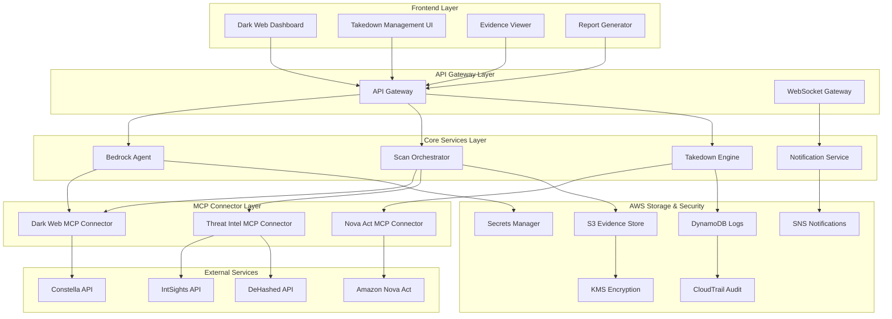

# Dark Web Intelligence & Automated Takedown Design Document

## Overview

The Dark Web Intelligence & Automated Takedown feature extends PrivacyGuard's capabilities with proactive threat monitoring and automated remediation. The system leverages AWS Bedrock for intelligent analysis, MCP connectors for threat intelligence integration, Amazon Nova Act for automated takedown actions, and a comprehensive AWS-native architecture for secure evidence management and compliance reporting.

This feature transforms PrivacyGuard from a reactive compliance tool into a proactive privacy protection platform that continuously monitors for data exposure risks and automatically initiates remediation actions.

## Architecture

### High-Level Architecture



### Component Architecture

The system follows a serverless, event-driven architecture with the following layers:

1. **Presentation Layer**: React-based dashboard components for dark web monitoring
2. **API Gateway Layer**: Serverless API endpoints with WebSocket support for real-time updates
3. **Core Services Layer**: Lambda functions orchestrating scanning, analysis, and takedown operations
4. **MCP Integration Layer**: Standardized connectors for external threat intelligence and automation services
5. **Storage & Security Layer**: AWS-native services for secure evidence storage and audit logging

## Components and Interfaces

### 1. Dark Web Scan Orchestrator

**Purpose**: Coordinates dark web monitoring across multiple threat intelligence sources and manages scan lifecycle.

**Key Responsibilities**:
- Schedule and execute dark web scans based on configured keywords and domains
- Aggregate results from multiple threat intelligence APIs
- Coordinate with Bedrock Agent for intelligent analysis and risk scoring
- Trigger automated takedown workflows for high-risk findings

**Interfaces**:
```typescript
interface DarkWebScanOrchestrator {
  executeScan(config: DarkWebScanConfig): Promise<ScanResult>
  schedulePeriodicScan(schedule: ScanSchedule): Promise<string>
  getActiveScanStatus(): Promise<ScanStatus[]>
  cancelScan(scanId: string): Promise<void>
  getScanHistory(filters: ScanHistoryFilter): Promise<ScanResult[]>
}

interface DarkWebScanConfig {
  keywords: string[]
  domains: string[]
  emailPatterns: string[]
  apiKeyHashes: string[]
  scanDepth: 'surface' | 'deep' | 'comprehensive'
  sources: ThreatIntelSource[]
  riskThreshold: RiskLevel
  autoTakedown: boolean
}

interface ScanResult {
  scanId: string
  timestamp: Date
  status: 'completed' | 'failed' | 'in_progress'
  findings: DarkWebFinding[]
  riskScore: number
  evidenceUrls: string[]
  takedownActions: TakedownAction[]
}
```

### 2. Bedrock Intelligence Engine

**Purpose**: Leverages AWS Bedrock (Claude/Titan) for intelligent analysis of dark web findings and automated decision-making.

**Key Responsibilities**:
- Analyze raw threat intelligence data for relevance and risk assessment
- Generate sanitized summaries that remove PII while preserving threat context
- Determine appropriate response actions based on exposure type and severity
- Create compliance-ready reports for audit and regulatory purposes

**Interfaces**:
```typescript
interface BedrockIntelligenceEngine {
  analyzeThreatData(rawData: ThreatData): Promise<ThreatAnalysis>
  generateSanitizedSummary(findings: DarkWebFinding[]): Promise<SanitizedReport>
  assessRiskScore(finding: DarkWebFinding): Promise<RiskAssessment>
  recommendActions(analysis: ThreatAnalysis): Promise<RecommendedAction[]>
  generateComplianceReport(findings: DarkWebFinding[]): Promise<ComplianceReport>
}

interface ThreatAnalysis {
  riskScore: number
  confidenceLevel: number
  exposureType: ExposureType
  dataClassification: DataClassification
  urgencyLevel: UrgencyLevel
  affectedSystems: string[]
  recommendedActions: RecommendedAction[]
  sanitizedSummary: string
}

interface SanitizedReport {
  executiveSummary: string
  threatOverview: string
  riskMetrics: RiskMetrics
  actionItems: ActionItem[]
  complianceImpact: ComplianceImpact
  redactionLog: RedactionEntry[]
}
```

### 3. Nova Act Takedown Engine

**Purpose**: Orchestrates automated takedown actions using Amazon Nova Act for UI-driven remediation.

**Key Responsibilities**:
- Execute automated takedown workflows through Nova Act
- Perform UI-driven actions to contact site administrators and submit removal requests
- Capture evidence of takedown attempts including screenshots and interaction logs
- Chain complex takedown sequences: detection → classification → remediation → documentation

**Interfaces**:
```typescript
interface NovaActTakedownEngine {
  executeTakedown(action: TakedownAction): Promise<TakedownResult>
  createTakedownWorkflow(finding: DarkWebFinding): Promise<TakedownWorkflow>
  monitorTakedownProgress(workflowId: string): Promise<TakedownStatus>
  captureEvidence(actionId: string): Promise<EvidenceCapture>
  generateTakedownReport(workflowId: string): Promise<TakedownReport>
}

interface TakedownAction {
  actionId: string
  type: TakedownType
  targetUrl: string
  contactMethod: ContactMethod
  evidenceUrls: string[]
  urgencyLevel: UrgencyLevel
  automationLevel: 'full' | 'assisted' | 'manual'
}

interface TakedownWorkflow {
  workflowId: string
  steps: TakedownStep[]
  estimatedDuration: number
  requiredApprovals: ApprovalRequirement[]
  fallbackActions: FallbackAction[]
}

interface TakedownResult {
  actionId: string
  status: 'success' | 'failed' | 'pending' | 'requires_manual'
  evidenceCapture: EvidenceCapture
  nextSteps: string[]
  completionTime: Date
  complianceDocumentation: ComplianceDoc[]
}
```

### 4. MCP Dark Web Connector

**Purpose**: Standardized MCP connector for integrating with multiple threat intelligence APIs.

**Supported APIs**:
- Constella Intelligence for credential monitoring
- IntSights for dark web marketplace monitoring
- DeHashed for breach database searches
- Custom threat feeds and OSINT sources

**Interfaces**:
```typescript
class DarkWebMCPConnector extends MCPConnector {
  async searchCredentials(query: CredentialQuery): Promise<CredentialResult[]>
  async searchMarketplaces(query: MarketplaceQuery): Promise<MarketplaceResult[]>
  async searchBreachDatabases(query: BreachQuery): Promise<BreachResult[]>
  async monitorKeywords(keywords: string[]): Promise<KeywordMonitorResult>
  async getSourceHealth(): Promise<SourceHealthStatus[]>
}

interface CredentialQuery {
  emails: string[]
  domains: string[]
  usernames: string[]
  apiKeyHashes: string[]
  timeRange: DateRange
}

interface DarkWebFinding {
  findingId: string
  source: ThreatIntelSource
  exposureType: ExposureType
  discoveredAt: Date
  lastSeen: Date
  riskScore: number
  affectedAssets: AffectedAsset[]
  evidenceHash: string
  sanitizedContent: string
  takedownStatus: TakedownStatus
}
```

### 5. Evidence Management System

**Purpose**: Secure storage and management of dark web evidence with proper encryption and access controls.

**Key Features**:
- KMS-encrypted S3 storage for evidence files
- Signed URLs with configurable expiry (default 30 days)
- Automatic PII redaction before storage
- Audit logging for all evidence access
- Compliance-ready evidence packaging for legal proceedings

**Interfaces**:
```typescript
interface EvidenceManager {
  storeEvidence(evidence: Evidence): Promise<EvidenceReference>
  retrieveEvidence(evidenceId: string): Promise<SignedUrl>
  redactPII(content: string): Promise<RedactedContent>
  generateEvidencePackage(findingIds: string[]): Promise<EvidencePackage>
  auditEvidenceAccess(evidenceId: string, accessor: string): Promise<void>
}

interface Evidence {
  type: EvidenceType
  content: Buffer | string
  metadata: EvidenceMetadata
  classification: DataClassification
  retentionPeriod: number
}

interface EvidenceReference {
  evidenceId: string
  s3Location: S3Location
  encryptionKey: string
  accessUrl: string
  expiryDate: Date
  checksumHash: string
}
```

### 6. Real-time Notification System

**Purpose**: Delivers immediate alerts for critical exposures through multiple channels.

**Notification Channels**:
- Amazon SNS for system-to-system notifications
- Microsoft Teams webhooks for team collaboration
- Slack integration for security teams
- Email alerts for executive notifications
- In-app notifications for dashboard users

**Interfaces**:
```typescript
interface NotificationSystem {
  sendCriticalAlert(alert: CriticalAlert): Promise<NotificationResult>
  sendTakedownUpdate(update: TakedownUpdate): Promise<NotificationResult>
  sendComplianceReport(report: ComplianceReport): Promise<NotificationResult>
  configureNotificationRules(rules: NotificationRule[]): Promise<void>
  getNotificationHistory(filters: NotificationFilter): Promise<NotificationLog[]>
}

interface CriticalAlert {
  alertId: string
  severity: AlertSeverity
  title: string
  description: string
  affectedAssets: string[]
  recommendedActions: string[]
  evidenceUrls: string[]
  escalationPath: EscalationRule[]
}
```

## Data Models

### Core Data Structures

```typescript
// Dark Web Finding
interface DarkWebFinding {
  findingId: string
  scanId: string
  source: ThreatIntelSource
  discoveredAt: Date
  lastSeen: Date
  exposureType: ExposureType
  riskScore: number
  confidenceLevel: number
  affectedAssets: AffectedAsset[]
  evidenceReferences: EvidenceReference[]
  sanitizedContent: string
  takedownStatus: TakedownStatus
  complianceFlags: ComplianceFlag[]
}

// Takedown Action
interface TakedownAction {
  actionId: string
  findingId: string
  type: TakedownType
  status: ActionStatus
  initiatedBy: string
  initiatedAt: Date
  completedAt?: Date
  targetPlatform: string
  contactMethod: ContactMethod
  evidenceSubmitted: EvidenceReference[]
  responseReceived?: PlatformResponse
  nextFollowUp?: Date
}

// Risk Assessment
interface RiskAssessment {
  assessmentId: string
  findingId: string
  riskScore: number
  riskFactors: RiskFactor[]
  businessImpact: BusinessImpact
  regulatoryImpact: RegulatoryImpact
  recommendedPriority: Priority
  mitigationStrategies: MitigationStrategy[]
}

// Evidence Package
interface EvidencePackage {
  packageId: string
  createdAt: Date
  findings: DarkWebFinding[]
  evidenceFiles: EvidenceReference[]
  chainOfCustody: CustodyRecord[]
  legalReadiness: boolean
  retentionPolicy: RetentionPolicy
}
```

### Database Schema

```sql
-- Dark Web Findings
CREATE TABLE dark_web_findings (
  finding_id UUID PRIMARY KEY,
  scan_id UUID NOT NULL,
  source VARCHAR(50) NOT NULL,
  discovered_at TIMESTAMP NOT NULL,
  last_seen TIMESTAMP NOT NULL,
  exposure_type VARCHAR(50) NOT NULL,
  risk_score INTEGER NOT NULL CHECK (risk_score >= 0 AND risk_score <= 100),
  confidence_level DECIMAL(3,2) NOT NULL,
  affected_assets JSONB NOT NULL,
  evidence_references JSONB NOT NULL,
  sanitized_content TEXT NOT NULL,
  takedown_status VARCHAR(20) DEFAULT 'pending',
  compliance_flags JSONB DEFAULT '[]',
  created_at TIMESTAMP DEFAULT NOW(),
  updated_at TIMESTAMP DEFAULT NOW()
);

-- Takedown Actions
CREATE TABLE takedown_actions (
  action_id UUID PRIMARY KEY,
  finding_id UUID REFERENCES dark_web_findings(finding_id),
  type VARCHAR(50) NOT NULL,
  status VARCHAR(20) NOT NULL DEFAULT 'pending',
  initiated_by VARCHAR(100) NOT NULL,
  initiated_at TIMESTAMP NOT NULL,
  completed_at TIMESTAMP,
  target_platform VARCHAR(100) NOT NULL,
  contact_method VARCHAR(50) NOT NULL,
  evidence_submitted JSONB DEFAULT '[]',
  response_received JSONB,
  next_followup TIMESTAMP,
  created_at TIMESTAMP DEFAULT NOW(),
  updated_at TIMESTAMP DEFAULT NOW()
);

-- Evidence Storage
CREATE TABLE evidence_storage (
  evidence_id UUID PRIMARY KEY,
  finding_id UUID REFERENCES dark_web_findings(finding_id),
  s3_location VARCHAR(500) NOT NULL,
  encryption_key_id VARCHAR(100) NOT NULL,
  evidence_type VARCHAR(50) NOT NULL,
  file_size BIGINT NOT NULL,
  checksum_hash VARCHAR(64) NOT NULL,
  access_url VARCHAR(500),
  expiry_date TIMESTAMP NOT NULL,
  classification VARCHAR(20) NOT NULL,
  retention_period INTEGER NOT NULL,
  created_at TIMESTAMP DEFAULT NOW()
);

-- Scan Configurations
CREATE TABLE dark_web_scan_configs (
  config_id UUID PRIMARY KEY,
  name VARCHAR(100) NOT NULL,
  keywords TEXT[] NOT NULL,
  domains TEXT[] NOT NULL,
  email_patterns TEXT[] NOT NULL,
  api_key_hashes TEXT[] NOT NULL,
  scan_depth VARCHAR(20) NOT NULL,
  sources JSONB NOT NULL,
  risk_threshold INTEGER NOT NULL,
  auto_takedown BOOLEAN DEFAULT false,
  schedule_cron VARCHAR(50),
  is_active BOOLEAN DEFAULT true,
  created_by VARCHAR(100) NOT NULL,
  created_at TIMESTAMP DEFAULT NOW(),
  updated_at TIMESTAMP DEFAULT NOW()
);

-- Notification Rules
CREATE TABLE notification_rules (
  rule_id UUID PRIMARY KEY,
  name VARCHAR(100) NOT NULL,
  trigger_conditions JSONB NOT NULL,
  notification_channels JSONB NOT NULL,
  escalation_rules JSONB DEFAULT '[]',
  is_active BOOLEAN DEFAULT true,
  created_at TIMESTAMP DEFAULT NOW(),
  updated_at TIMESTAMP DEFAULT NOW()
);
```

## Error Handling

### Threat Intelligence API Failures
- **Rate Limiting**: Implement exponential backoff with jitter for API rate limits
- **Authentication Errors**: Automatic credential refresh using AWS Secrets Manager rotation
- **Service Unavailability**: Graceful degradation with alternative sources and cached results
- **Data Quality Issues**: Validation and sanitization of threat intelligence data

### Nova Act Automation Failures
- **UI Element Changes**: Adaptive selectors with fallback strategies
- **Network Timeouts**: Configurable retry policies with circuit breaker pattern
- **Platform Blocking**: Alternative contact methods and manual escalation paths
- **Evidence Capture Failures**: Multiple screenshot attempts and error logging

### Evidence Storage Failures
- **S3 Upload Errors**: Retry with exponential backoff and alternative regions
- **Encryption Failures**: KMS key rotation and backup encryption methods
- **Access Control Issues**: IAM policy validation and automatic remediation
- **Data Corruption**: Checksum validation and integrity monitoring

### System-Level Error Handling
- **Lambda Timeouts**: Function splitting and asynchronous processing patterns
- **DynamoDB Throttling**: Auto-scaling configuration and request batching
- **Cross-Service Communication**: Dead letter queues and retry mechanisms
- **Monitoring Failures**: Multi-layered observability with CloudWatch and X-Ray

## Testing Strategy

### Unit Testing
- **Threat Intelligence Processing**: Mock API responses for isolated connector testing
- **Risk Assessment Logic**: Synthetic threat data for scoring algorithm validation
- **Evidence Management**: Test encryption, storage, and retrieval operations
- **Notification System**: Mock external services for delivery testing

### Integration Testing
- **MCP Connector Integration**: Sandbox environments for threat intelligence APIs
- **Bedrock Agent Testing**: Validate AI analysis accuracy with known threat scenarios
- **Nova Act Workflows**: Test automation sequences in controlled environments
- **AWS Service Integration**: Validate S3, DynamoDB, and SNS operations

### End-to-End Testing
- **Complete Threat Response**: Full workflow from detection to takedown completion
- **Multi-Source Scenarios**: Validate aggregation across multiple threat intelligence sources
- **Compliance Reporting**: Test report generation and evidence packaging
- **Real-time Notifications**: Validate alert delivery across all channels

### Security Testing
- **Credential Management**: Validate encryption and secure storage of API keys
- **Evidence Protection**: Test PII redaction and access control mechanisms
- **Audit Trail Integrity**: Validate CloudTrail logging and tamper detection
- **Penetration Testing**: Third-party security assessment of threat intelligence handling

### Performance Testing
- **Scan Performance**: Measure processing time across different data volumes
- **Concurrent Operations**: Test system behavior under multiple simultaneous scans
- **Evidence Storage**: Validate S3 performance under high-volume evidence uploads
- **Real-time Processing**: Test WebSocket performance for dashboard updates

## Security Considerations

### Data Protection
- **PII Redaction**: Automatic removal of sensitive data before storage and analysis
- **Evidence Encryption**: AES-256 encryption for all stored evidence with KMS key management
- **Access Controls**: Role-based permissions with principle of least privilege
- **Audit Logging**: Comprehensive CloudTrail integration for all system activities

### Threat Intelligence Security
- **API Key Management**: Secure storage in AWS Secrets Manager with automatic rotation
- **Data Validation**: Input sanitization and validation for all external threat data
- **Network Security**: VPC endpoints and security groups for internal communication
- **Rate Limiting**: Protection against API abuse and cost management

### Compliance Requirements
- **GDPR Compliance**: Right to erasure implementation for evidence data
- **SOC 2 Controls**: Security and availability controls for threat intelligence processing
- **Data Residency**: Regional data storage compliance for international operations
- **Retention Policies**: Automated data lifecycle management with legal hold capabilities

### Operational Security
- **Incident Response**: Automated escalation for critical security findings
- **Threat Hunting**: Integration with existing SIEM and security operations
- **False Positive Management**: Machine learning-based accuracy improvement
- **Vendor Risk Management**: Security assessment of threat intelligence providers

## Performance Optimization

### Caching Strategy
- **Threat Intelligence Caching**: Redis-based caching for frequently accessed threat data
- **Evidence Caching**: CloudFront distribution for evidence file access
- **API Response Caching**: API Gateway caching for dashboard queries
- **Database Query Optimization**: DynamoDB GSI design for efficient querying

### Scalability Design
- **Auto-scaling**: Lambda concurrency limits and DynamoDB auto-scaling
- **Load Balancing**: API Gateway regional distribution for global access
- **Batch Processing**: SQS-based queuing for high-volume threat intelligence processing
- **Resource Optimization**: Right-sizing of Lambda functions and database capacity

### Monitoring and Observability
- **Real-time Metrics**: CloudWatch dashboards for system health monitoring
- **Distributed Tracing**: X-Ray integration for end-to-end request tracking
- **Custom Metrics**: Business-specific KPIs for threat detection effectiveness
- **Alerting**: Proactive monitoring with automated incident response