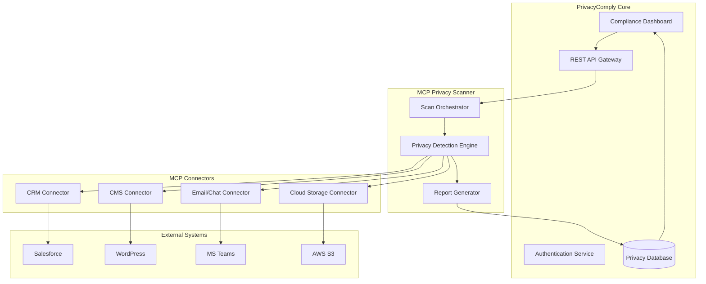

# MCP Privacy Connectors Design Document

## Overview

The MCP Privacy Connectors feature extends PrivacyComply Agent with real-time privacy scanning capabilities across external systems. The architecture leverages Model Context Protocol (MCP) to create standardized, modular connectors that integrate with CRM, CMS, email/chat, and cloud storage platforms. The system provides automated PII discovery, consent management, and compliance monitoring through a unified dashboard interface.

## Architecture

### High-Level Architecture



### Component Architecture

The system follows a layered architecture with clear separation of concerns:

1. **Presentation Layer**: React-based dashboard components integrated with existing PrivacyComply UI
2. **API Layer**: RESTful endpoints for MCP operations and real-time WebSocket connections
3. **Business Logic Layer**: Privacy scanning orchestration and detection algorithms
4. **Integration Layer**: MCP connector modules for external system communication
5. **Data Layer**: Enhanced database schema for storing scan results and configurations

## Components and Interfaces

### 1. MCP Scan Orchestrator

**Purpose**: Coordinates privacy scans across multiple connected systems and manages scan lifecycle.

**Key Responsibilities**:
- Schedule and execute unified privacy scans
- Manage connector lifecycle and health monitoring
- Aggregate results from multiple connectors
- Handle error recovery and retry logic

**Interfaces**:
```typescript
interface ScanOrchestrator {
  executeGlobalScan(config: ScanConfiguration): Promise<ScanResult>
  schedulePeriodicScan(schedule: CronExpression): void
  getConnectorStatus(): ConnectorHealth[]
  cancelScan(scanId: string): Promise<void>
}

interface ScanConfiguration {
  connectors: string[]
  scanDepth: 'shallow' | 'deep'
  includeArchived: boolean
  customRules: PrivacyRule[]
}
```

### 2. Privacy Detection Engine

**Purpose**: Core PII detection and classification logic using multiple detection methods.

**Detection Methods**:
- Regex pattern matching for common PII formats
- ML-based entity recognition using existing spaCy/Transformers models
- Context-aware classification based on field names and data relationships
- Custom rule engine for organization-specific privacy policies

**Interfaces**:
```typescript
interface PrivacyDetectionEngine {
  detectPII(content: string, context: ScanContext): PIIDetectionResult
  classifyDataSensitivity(data: any): SensitivityLevel
  validateConsent(record: any, consentRules: ConsentRule[]): ConsentStatus
  generateRemediation(findings: PIIFinding[]): RemediationAction[]
}

interface PIIDetectionResult {
  findings: PIIFinding[]
  confidence: number
  sensitivityLevel: SensitivityLevel
  suggestedActions: RemediationAction[]
}
```

### 3. MCP Connector Framework

**Purpose**: Standardized framework for implementing platform-specific connectors.

**Base Connector Interface**:
```typescript
abstract class MCPConnector {
  abstract connect(credentials: ConnectorCredentials): Promise<void>
  abstract scan(config: ScanConfig): Promise<ScanResult>
  abstract remediate(actions: RemediationAction[]): Promise<RemediationResult>
  abstract getHealth(): ConnectorHealth
  
  protected authenticate(): Promise<AuthToken>
  protected handleRateLimit(): Promise<void>
  protected logActivity(activity: ConnectorActivity): void
}
```

### 4. Connector Implementations

#### CRM Connector (Salesforce/HubSpot/Zoho)
```typescript
class CRMConnector extends MCPConnector {
  async scanContacts(filters: ContactFilter[]): Promise<ContactScanResult>
  async scanLeads(filters: LeadFilter[]): Promise<LeadScanResult>
  async updateConsentStatus(recordId: string, status: ConsentStatus): Promise<void>
  async deleteExpiredRecords(criteria: DeletionCriteria): Promise<DeletionResult>
}
```

#### CMS Connector (WordPress/Shopify)
```typescript
class CMSConnector extends MCPConnector {
  async scanPages(siteUrl: string): Promise<PageScanResult>
  async scanComments(): Promise<CommentScanResult>
  async detectTrackers(): Promise<TrackerDetectionResult>
  async auditPrivacyPolicy(): Promise<PolicyAuditResult>
}
```

#### Email/Chat Connector (Teams/Outlook/Gmail)
```typescript
class EmailChatConnector extends MCPConnector {
  async scanMessages(timeRange: DateRange): Promise<MessageScanResult>
  async scanAttachments(filters: AttachmentFilter[]): Promise<AttachmentScanResult>
  async detectExternalSharing(): Promise<SharingRiskResult>
  async generateAnonymizedSummary(): Promise<CommunicationSummary>
}
```

#### Cloud Storage Connector (AWS S3/RDS)
```typescript
class CloudStorageConnector extends MCPConnector {
  async scanBuckets(bucketNames: string[]): Promise<BucketScanResult>
  async scanDatabases(connectionStrings: string[]): Promise<DatabaseScanResult>
  async checkEncryption(): Promise<EncryptionAuditResult>
  async applyRetentionPolicies(): Promise<RetentionResult>
}
```

### 5. Dashboard Integration Components

#### Real-time MCP Dashboard
```typescript
interface MCPDashboardProps {
  connectors: ConnectorStatus[]
  scanResults: ScanResult[]
  alerts: PrivacyAlert[]
  onExecuteScan: (config: ScanConfiguration) => void
}

const MCPDashboard: React.FC<MCPDashboardProps> = ({
  connectors,
  scanResults,
  alerts,
  onExecuteScan
}) => {
  // Real-time dashboard implementation
}
```

#### Connector Management Interface
```typescript
const ConnectorManagement: React.FC = () => {
  // Connector configuration and health monitoring
}
```

## Data Models

### Scan Results Schema
```typescript
interface ScanResult {
  id: string
  scanId: string
  connectorType: ConnectorType
  timestamp: Date
  status: 'completed' | 'failed' | 'in_progress'
  findings: PIIFinding[]
  metrics: ScanMetrics
  remediationActions: RemediationAction[]
}

interface PIIFinding {
  id: string
  type: PIIType
  location: DataLocation
  content: string // masked/hashed
  confidence: number
  sensitivityLevel: SensitivityLevel
  consentStatus: ConsentStatus
  recommendedAction: RemediationAction
}

interface ConnectorConfiguration {
  id: string
  type: ConnectorType
  name: string
  credentials: EncryptedCredentials
  scanSchedule: CronExpression
  customRules: PrivacyRule[]
  isEnabled: boolean
}
```

### Database Schema Extensions
```sql
-- MCP Connectors table
CREATE TABLE mcp_connectors (
  id UUID PRIMARY KEY,
  type VARCHAR(50) NOT NULL,
  name VARCHAR(100) NOT NULL,
  configuration JSONB NOT NULL,
  credentials_encrypted TEXT NOT NULL,
  is_enabled BOOLEAN DEFAULT true,
  created_at TIMESTAMP DEFAULT NOW(),
  updated_at TIMESTAMP DEFAULT NOW()
);

-- Scan Results table
CREATE TABLE mcp_scan_results (
  id UUID PRIMARY KEY,
  scan_id UUID NOT NULL,
  connector_id UUID REFERENCES mcp_connectors(id),
  status VARCHAR(20) NOT NULL,
  findings JSONB NOT NULL,
  metrics JSONB NOT NULL,
  started_at TIMESTAMP NOT NULL,
  completed_at TIMESTAMP,
  created_at TIMESTAMP DEFAULT NOW()
);

-- Privacy Findings table
CREATE TABLE privacy_findings (
  id UUID PRIMARY KEY,
  scan_result_id UUID REFERENCES mcp_scan_results(id),
  pii_type VARCHAR(50) NOT NULL,
  location JSONB NOT NULL,
  confidence DECIMAL(3,2) NOT NULL,
  sensitivity_level VARCHAR(20) NOT NULL,
  consent_status VARCHAR(20),
  remediation_status VARCHAR(20) DEFAULT 'pending',
  created_at TIMESTAMP DEFAULT NOW()
);
```

## Error Handling

### Connector Error Handling
- **Connection Failures**: Implement exponential backoff with circuit breaker pattern
- **Rate Limiting**: Respect API rate limits with intelligent queuing
- **Authentication Errors**: Automatic token refresh with fallback to manual intervention
- **Data Processing Errors**: Graceful degradation with partial results reporting

### System-Level Error Handling
- **Scan Failures**: Continue with other connectors, report partial results
- **Database Errors**: Implement transaction rollback and retry mechanisms
- **Network Issues**: Queue operations for retry when connectivity is restored

## Testing Strategy

### Unit Testing
- **Connector Logic**: Mock external API responses for isolated testing
- **Privacy Detection**: Test PII detection accuracy with synthetic datasets
- **Data Processing**: Validate data transformation and classification logic

### Integration Testing
- **API Integration**: Test connector communication with sandbox environments
- **Database Operations**: Validate data persistence and retrieval operations
- **WebSocket Communication**: Test real-time dashboard updates

### End-to-End Testing
- **Complete Scan Workflows**: Test full scan execution from trigger to dashboard display
- **Multi-Connector Scenarios**: Validate coordinated scanning across multiple systems
- **Error Recovery**: Test system behavior under various failure conditions

### Security Testing
- **Credential Management**: Validate encryption and secure storage of API credentials
- **Data Masking**: Ensure PII is properly masked in logs and non-production environments
- **Access Controls**: Test role-based permissions for connector management

### Performance Testing
- **Scan Performance**: Measure scan execution time across different data volumes
- **Concurrent Operations**: Test system behavior under multiple simultaneous scans
- **Resource Utilization**: Monitor memory and CPU usage during intensive operations

## Security Considerations

### Data Protection
- All PII findings are hashed/masked before storage
- Credentials encrypted using AES-256 with key rotation
- Audit logs for all privacy-related operations
- Data retention policies for scan results and findings

### Access Control
- Role-based permissions for connector management
- API key authentication for external integrations
- Multi-factor authentication for sensitive operations
- Principle of least privilege for system components

### Compliance
- GDPR compliance for data processing activities
- SOC 2 Type II controls for security and availability
- Privacy by design principles throughout architecture
- Regular security assessments and penetration testing