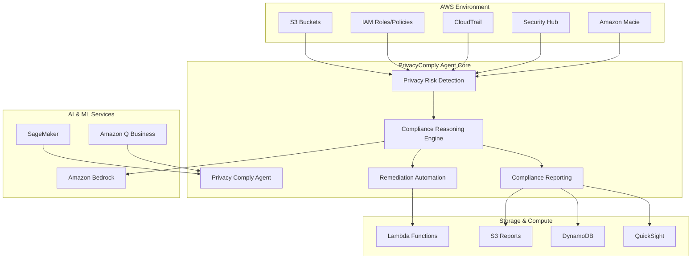

# PrivacyComply Agent Design Document

## Overview

The PrivacyComply Agent is an autonomous AI-powered privacy compliance system that integrates with AWS services to provide continuous monitoring, intelligent analysis, and automated remediation of privacy compliance violations. The system leverages Amazon Bedrock for AI reasoning, AWS Security services for monitoring, and Lambda for automated remediation workflows.

## Architecture

### High-Level Architecture



### Component Architecture

The system follows a microservices architecture with the following core components:

1. **Privacy Risk Detection Service** - Monitors AWS resources for compliance violations
2. **Compliance Reasoning Engine** - AI-powered analysis and legal mapping
3. **Remediation Automation Service** - Executes automated fixes
4. **Compliance Reporting Service** - Generates reports and documentation
5. **Natural Language Interface** - Handles user queries and interactions

## Components and Interfaces

### Privacy Risk Detection Service

**Purpose**: Continuously scan AWS environment for privacy and compliance risks

**Key Responsibilities**:
- Monitor S3 buckets for public access and encryption status
- Analyze IAM roles and policies for overprivileged access
- Process CloudTrail logs for unauthorized data access
- Integrate with Amazon Macie for PII/PHI detection
- Aggregate findings from AWS Security Hub

**Interfaces**:
```typescript
interface PrivacyRiskDetector {
  scanS3Buckets(): Promise<S3ComplianceFindings[]>
  analyzeIAMPolicies(): Promise<IAMComplianceFindings[]>
  processCloudTrailLogs(): Promise<AccessViolationFindings[]>
  getMacieFindings(): Promise<PIIDetectionFindings[]>
  getSecurityHubFindings(): Promise<SecurityComplianceFindings[]>
}

interface ComplianceFinding {
  id: string
  resourceArn: string
  findingType: 'ENCRYPTION' | 'ACCESS_CONTROL' | 'PII_EXPOSURE' | 'LOGGING'
  severity: 'LOW' | 'MEDIUM' | 'HIGH' | 'CRITICAL'
  description: string
  detectedAt: Date
  rawData: any
}
```

### Compliance Reasoning Engine

**Purpose**: Analyze findings using AI to map violations to legal articles and assess compliance impact

**Key Responsibilities**:
- Use Amazon Bedrock (Claude 3/Nova) for intelligent analysis
- Map findings to specific GDPR, PDPL, and CCPA articles
- Calculate risk scores and compliance impact
- Generate remediation recommendations
- Maintain decision audit trails

**Interfaces**:
```typescript
interface ComplianceReasoningEngine {
  analyzeFinding(finding: ComplianceFinding): Promise<ComplianceAssessment>
  mapToLegalArticles(finding: ComplianceFinding): Promise<LegalMapping[]>
  calculateRiskScore(assessment: ComplianceAssessment): Promise<number>
  generateRecommendations(assessment: ComplianceAssessment): Promise<RemediationRecommendation[]>
}

interface ComplianceAssessment {
  findingId: string
  legalMappings: LegalMapping[]
  riskScore: number
  confidenceScore: number
  recommendations: RemediationRecommendation[]
  reasoning: string
  assessedAt: Date
}

interface LegalMapping {
  regulation: 'GDPR' | 'PDPL' | 'CCPA'
  article: string
  description: string
  applicability: number
}
```

### Remediation Automation Service

**Purpose**: Execute automated remediation actions for common compliance violations

**Key Responsibilities**:
- Implement automated fixes through Lambda functions
- Manage remediation workflows and approvals
- Track remediation success and failures
- Maintain audit logs of all actions

**Interfaces**:
```typescript
interface RemediationAutomationService {
  executeRemediation(recommendation: RemediationRecommendation): Promise<RemediationResult>
  scheduleRemediation(recommendation: RemediationRecommendation, schedule: Date): Promise<string>
  getRemediationStatus(remediationId: string): Promise<RemediationStatus>
  rollbackRemediation(remediationId: string): Promise<RemediationResult>
}

interface RemediationRecommendation {
  id: string
  findingId: string
  action: 'RESTRICT_ACCESS' | 'ENABLE_ENCRYPTION' | 'UPDATE_POLICY' | 'ENABLE_LOGGING'
  priority: 'LOW' | 'MEDIUM' | 'HIGH' | 'CRITICAL'
  automatable: boolean
  lambdaFunction: string
  parameters: Record<string, any>
  estimatedImpact: string
}
```

### Compliance Reporting Service

**Purpose**: Generate comprehensive compliance reports and documentation

**Key Responsibilities**:
- Create DPIA (Data Protection Impact Assessment) reports
- Generate RoPA (Records of Processing Activities)
- Produce audit reports and compliance summaries
- Store reports securely in S3 with encryption
- Provide data visualization through QuickSight integration

**Interfaces**:
```typescript
interface ComplianceReportingService {
  generateDPIA(scope: ReportScope): Promise<DPIAReport>
  generateRoPA(scope: ReportScope): Promise<RoPAReport>
  generateAuditReport(timeRange: DateRange): Promise<AuditReport>
  generateComplianceSummary(regulation: string, department?: string): Promise<ComplianceSummary>
  storeReport(report: ComplianceReport): Promise<string>
}

interface ComplianceReport {
  id: string
  type: 'DPIA' | 'ROPA' | 'AUDIT' | 'SUMMARY'
  generatedAt: Date
  scope: ReportScope
  findings: ComplianceFinding[]
  assessments: ComplianceAssessment[]
  recommendations: RemediationRecommendation[]
  executiveSummary: string
}
```

### Natural Language Interface

**Purpose**: Provide conversational access to compliance information and system capabilities

**Key Responsibilities**:
- Process natural language queries about compliance status
- Generate human-readable responses with legal context
- Maintain conversation context and history
- Integrate with Amazon Q Business for enhanced query processing

**Interfaces**:
```typescript
interface NaturalLanguageInterface {
  processQuery(query: string, context?: ConversationContext): Promise<QueryResponse>
  generateNaturalLanguageReport(report: ComplianceReport): Promise<string>
  explainFinding(findingId: string): Promise<string>
  suggestQueries(): Promise<string[]>
}

interface QueryResponse {
  answer: string
  confidence: number
  sources: string[]
  relatedFindings: ComplianceFinding[]
  suggestedActions: string[]
  conversationId: string
}
```

## Data Models

### Core Data Structures

```typescript
// AWS Resource Models
interface AWSResource {
  arn: string
  resourceType: string
  region: string
  tags: Record<string, string>
  lastModified: Date
}

interface S3BucketResource extends AWSResource {
  bucketName: string
  publicAccess: boolean
  encryption: {
    enabled: boolean
    keyId?: string
  }
  versioning: boolean
  logging: boolean
}

// Compliance Models
interface ComplianceRule {
  id: string
  regulation: string
  article: string
  description: string
  checkFunction: string
  severity: string
  automatedRemediation?: string
}

interface ComplianceStatus {
  resourceArn: string
  rules: {
    ruleId: string
    compliant: boolean
    lastChecked: Date
    findings?: ComplianceFinding[]
  }[]
  overallScore: number
}

// ML Training Models
interface TrainingData {
  findingId: string
  features: Record<string, any>
  humanFeedback?: {
    correctAssessment: boolean
    correctRemediation: boolean
    comments: string
  }
  outcome: {
    remediationSuccess: boolean
    falsePositive: boolean
  }
}
```

## Error Handling

### Error Categories and Strategies

1. **AWS Service Errors**
   - Implement exponential backoff for rate limiting
   - Circuit breaker pattern for service unavailability
   - Graceful degradation when services are partially available

2. **AI/ML Model Errors**
   - Fallback to rule-based analysis when Bedrock is unavailable
   - Confidence thresholds to prevent low-quality assessments
   - Human review queue for uncertain cases

3. **Remediation Errors**
   - Rollback mechanisms for failed automated fixes
   - Approval workflows for high-risk remediations
   - Detailed error logging and alerting

4. **Data Processing Errors**
   - Retry mechanisms for transient failures
   - Dead letter queues for persistent failures
   - Data validation and sanitization

### Error Response Format

```typescript
interface ErrorResponse {
  errorCode: string
  message: string
  details?: any
  retryable: boolean
  suggestedAction?: string
  timestamp: Date
}
```

## Testing Strategy

### Unit Testing
- Test individual components in isolation
- Mock AWS service calls using AWS SDK mocks
- Test AI model responses with predefined scenarios
- Validate data transformation and business logic

### Integration Testing
- Test AWS service integrations with localstack
- Validate end-to-end compliance workflows
- Test remediation automation with safe test resources
- Verify report generation and storage

### Performance Testing
- Load testing for concurrent compliance scans
- Stress testing AI reasoning engine with large datasets
- Latency testing for natural language query responses
- Scalability testing for multi-account environments

### Security Testing
- Penetration testing for API endpoints
- IAM permission validation
- Data encryption verification
- Audit trail integrity testing

### Compliance Testing
- Validate accuracy of legal article mappings
- Test remediation effectiveness
- Verify report completeness and accuracy
- Validate audit trail completeness

## Deployment and Infrastructure

### AWS Services Integration
- **Amazon Bedrock**: Claude 3 Sonnet/Nova for AI reasoning
- **AWS Lambda**: Serverless remediation functions
- **Amazon DynamoDB**: Compliance data storage
- **Amazon S3**: Report storage and data lake
- **AWS Security Hub**: Centralized security findings
- **Amazon Macie**: PII/PHI detection
- **AWS CloudTrail**: Audit logging
- **Amazon SageMaker**: ML model training and inference
- **Amazon Q Business**: Enhanced query processing
- **Amazon QuickSight**: Compliance dashboards

### Security Considerations
- All data encrypted in transit and at rest
- IAM roles with least privilege access
- VPC endpoints for secure service communication
- CloudTrail logging for all system actions
- Regular security assessments and updates

### Monitoring and Observability
- CloudWatch metrics for system performance
- X-Ray tracing for request flow analysis
- Custom dashboards for compliance metrics
- Alerting for critical compliance violations
- Regular health checks and system validation