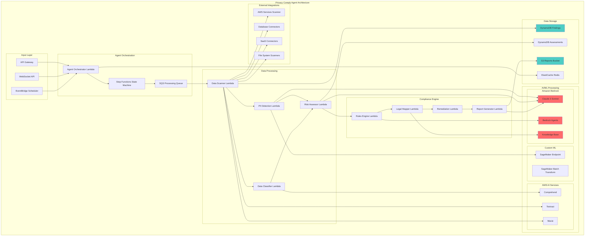
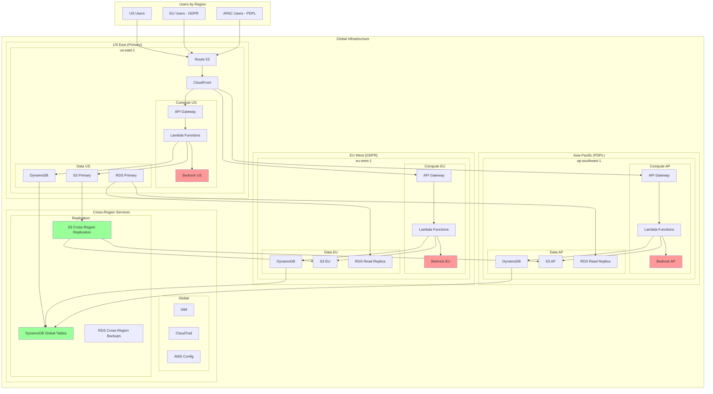
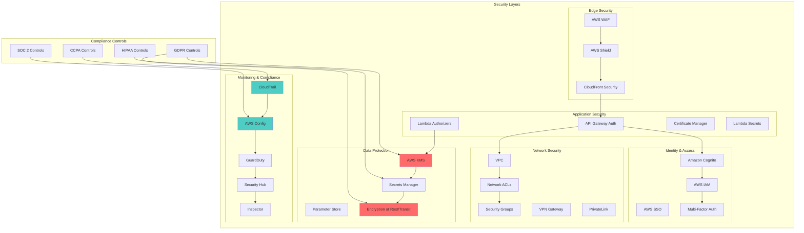
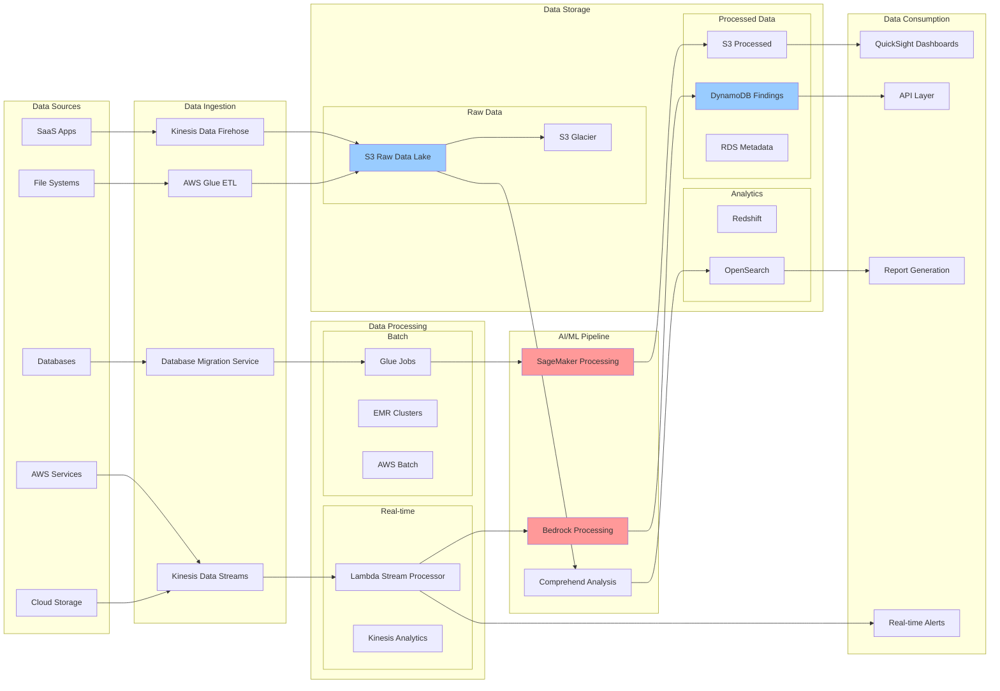
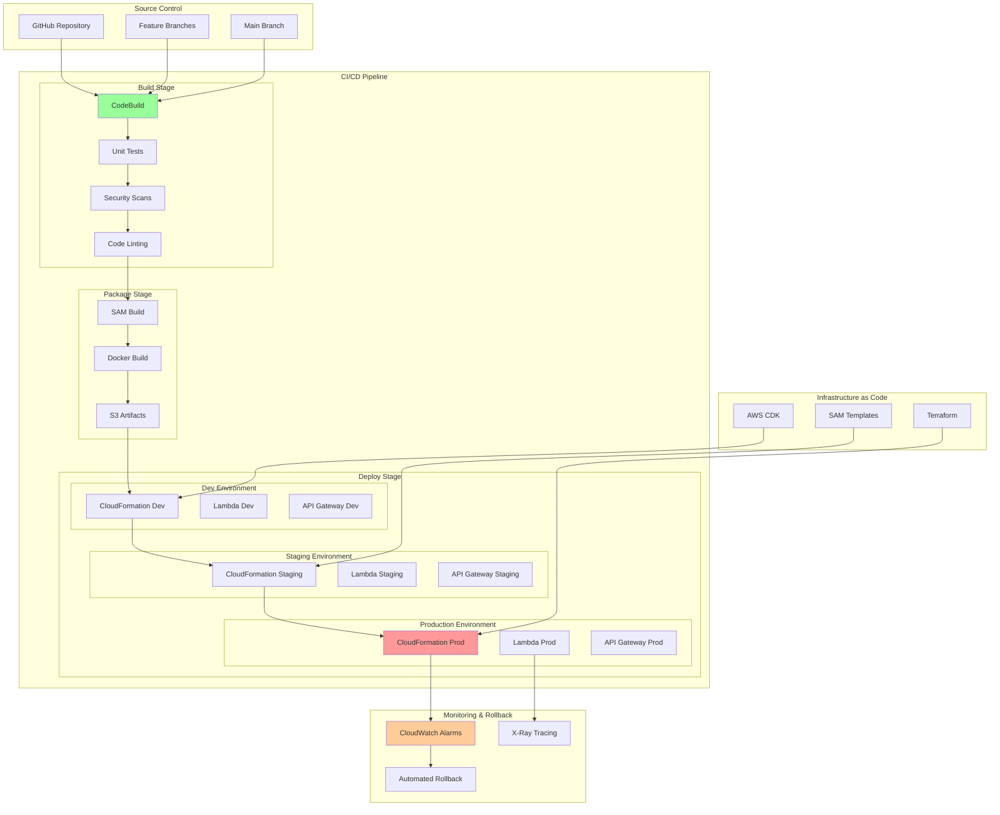
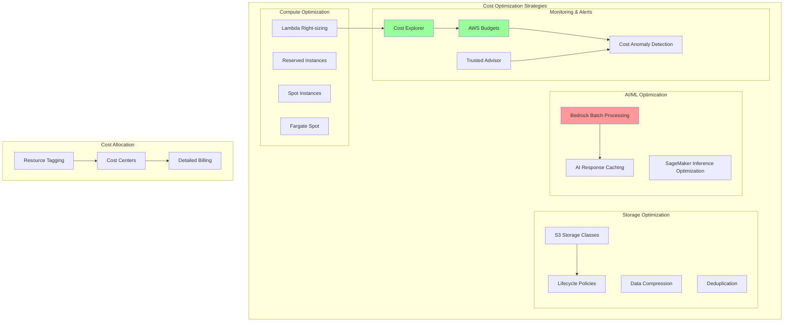

# PrivacyGuard AWS Architecture Diagrams

This document provides comprehensive architecture diagrams for the PrivacyGuard AWS integration, following AWS Well-Architected Framework principles.

## 🏗️ High-Level Architecture Overview

```mermaid
graph TB
    subgraph "User Layer"
        U1[Privacy Officers]
        U2[Compliance Teams]
        U3[Data Subjects]
        U4[Auditors]
    end

    subgraph "AWS Cloud"
        subgraph "Edge & CDN"
            CF[CloudFront CDN]
            WAF[AWS WAF]
        end

        subgraph "API Gateway Layer"
            APIGW[API Gateway]
            AUTH[Cognito/Custom Auth]
        end

        subgraph "Compute Layer"
            subgraph "Serverless Functions"
                L1[Agent Lambda]
                L2[Compliance Lambda]
                L3[DSAR Lambda]
                L4[Report Lambda]
            end
            
            subgraph "AI/ML Services"
                BR[Amazon Bedrock]
                SM[SageMaker]
                COMP[Amazon Comprehend]
            end
        end

        subgraph "Data Layer"
            subgraph "Databases"
                DDB[DynamoDB]
                RDS[RDS PostgreSQL]
                DOC[DocumentDB]
            end
            
            subgraph "Storage"
                S3[S3 Buckets]
                EFS[EFS]
            end
        end

        subgraph "Integration Layer"
            SQS[SQS Queues]
            SNS[SNS Topics]
            EB[EventBridge]
            SF[Step Functions]
        end

        subgraph "Monitoring & Security"
            CW[CloudWatch]
            CT[CloudTrail]
            SM_SEC[Secrets Manager]
            KMS[AWS KMS]
        end
    end

    subgraph "External Systems"
        EXT1[Customer Databases]
        EXT2[SaaS Applications]
        EXT3[File Systems]
        EXT4[Cloud Storage]
    end

    %% User connections
    U1 --> CF
    U2 --> CF
    U3 --> CF
    U4 --> CF

    %% Edge layer
    CF --> WAF
    WAF --> APIGW

    %% API Gateway
    APIGW --> AUTH
    APIGW --> L1
    APIGW --> L2
    APIGW --> L3
    APIGW --> L4

    %% Lambda to AI/ML
    L1 --> BR
    L1 --> SM
    L2 --> BR
    L2 --> COMP

    %% Lambda to Data
    L1 --> DDB
    L2 --> DDB
    L3 --> RDS
    L4 --> S3

    %% Integration
    L1 --> SQS
    L2 --> SNS
    L3 --> EB
    L4 --> SF

    %% External connections
    L1 --> EXT1
    L1 --> EXT2
    L1 --> EXT3
    L1 --> EXT4

    %% Monitoring
    L1 --> CW
    L2 --> CW
    L3 --> CW
    L4 --> CW

    style BR fill:#ff9999
    style SM fill:#ff9999
    style COMP fill:#ff9999
    style DDB fill:#99ccff
    style RDS fill:#99ccff
    style S3 fill:#99ccff
```

## 🤖 AI Agent Architecture Detail

## 🏢 Multi-Region Deployment Architecture

## 🔒 Security Architecture

## 📊 Data Flow Architecture

## 🚀 Deployment Pipeline Architecture

## 💰 Cost Optimization Architecture

## 📋 Architecture Decision Records (ADRs)

### ADR-001: Serverless-First Architecture
**Decision**: Use AWS Lambda for compute layer
**Rationale**: 
- Pay-per-use pricing model
- Automatic scaling
- Reduced operational overhead
- Better cost optimization for variable workloads

### ADR-002: Amazon Bedrock for AI/ML
**Decision**: Use Amazon Bedrock with Claude 3 Sonnet
**Rationale**:
- Managed service reduces ML infrastructure complexity
- Claude 3 Sonnet excels at compliance reasoning
- Built-in security and compliance features
- Streaming capabilities for real-time responses

### ADR-003: Multi-Region Deployment
**Decision**: Deploy across US, EU, and APAC regions
**Rationale**:
- Data residency requirements (GDPR, PDPL)
- Reduced latency for global users
- Disaster recovery and high availability
- Compliance with local regulations

### ADR-004: Event-Driven Architecture
**Decision**: Use EventBridge and SQS for service communication
**Rationale**:
- Loose coupling between services
- Better scalability and resilience
- Easier to add new features
- Built-in retry and dead letter queue capabilities

### ADR-005: DynamoDB for Findings Storage
**Decision**: Use DynamoDB for compliance findings
**Rationale**:
- Single-digit millisecond latency
- Automatic scaling
- Global tables for multi-region
- Strong consistency options

## 🔧 Implementation Phases

### Phase 1: Core Infrastructure (Weeks 1-2)
- [ ] Set up multi-region VPCs
- [ ] Deploy API Gateway and Lambda functions
- [ ] Configure DynamoDB tables
- [ ] Set up S3 buckets with encryption

### Phase 2: AI/ML Integration (Weeks 3-4)
- [ ] Integrate Amazon Bedrock
- [ ] Deploy SageMaker endpoints
- [ ] Configure Comprehend integration
- [ ] Set up knowledge bases

### Phase 3: Security & Compliance (Weeks 5-6)
- [ ] Implement WAF rules
- [ ] Configure IAM roles and policies
- [ ] Set up encryption with KMS
- [ ] Deploy monitoring and logging

### Phase 4: Optimization & Monitoring (Weeks 7-8)
- [ ] Implement cost optimization
- [ ] Set up comprehensive monitoring
- [ ] Configure alerting and notifications
- [ ] Performance tuning and optimization

---

These architecture diagrams provide a comprehensive view of the PrivacyGuard AWS integration, covering all aspects from high-level architecture to detailed implementation considerations. Each diagram follows AWS best practices and can be used for stakeholder communication, implementation planning, and system documentation.